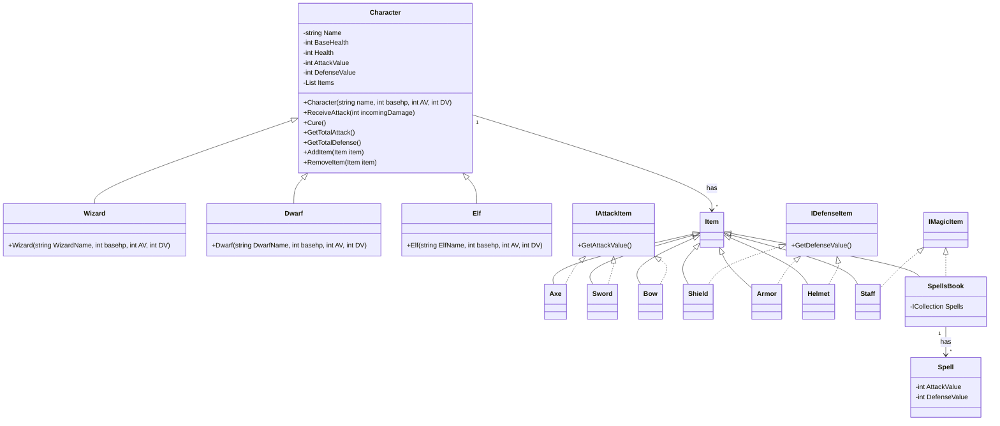

# Diagrama de clases

Completa a continuación tu diagrama de clases usando
[Mermaid](https://mermaid.live/edit). Debes completar el diagrama agregando las
clases y sus atributos, operaciones y relaciones faltantes. La ventaja de usar
**Mermaid** es que el diagrama es simplemente texto en un archivo
[Markdown](https://www.markdownguide.org) como este, y no gráficos ni imágenes.

